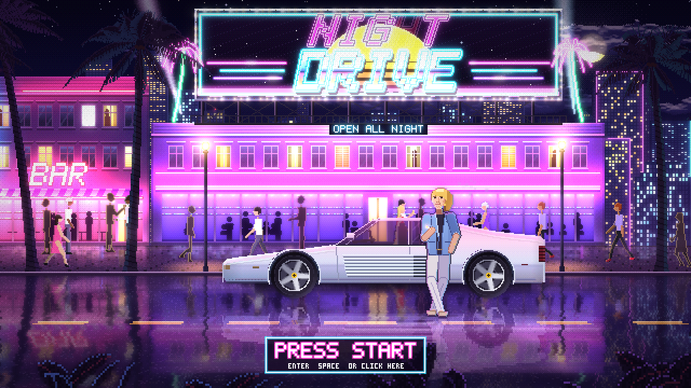
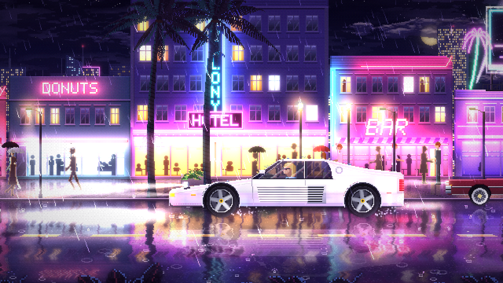

# Nightdrive — Endless Night Run

**Play it: [korak-the-mighty.github.io/nightdrive](https://korak-the-mighty.github.io/nightdrive/)**

An endless, procedurally generated pixel-art night drive through a neon Art Deco
beach strip. It's a white 80s supercar cruising past hotels, bars and motels under
palm trees, with wet-road reflections and bloom. Everything is drawn in code:
there are no image assets. It runs in any modern browser and is built to be
screen-captured as the visual for long mixtapes.

It opens outside the NIGHT DRIVE club. The car is parked with the engine off
under a rooftop neon extravaganza: a striped outrun sun, NIGHT in hot-pink
tubes, DRIVE in chrome, chasing marquee bulbs, neon palms and two searchlights
sweeping the sky. It buzzes on letter by letter, and its light washes over the
car. Our man leans on the car, smoking, looking around and talking to you now
and then ("I'd offer you a cigarette, but... you're a screen."), while the
music holds an inviting groove. Press START and he flicks the cigarette, walks
to the door and opens it, and (old-school, one cut) he's in the seat and the
door slams. He fires her
up (pop-up headlights and all), puts the shades on, turns to the camera, lights
a cigarette with a chrome lighter, blows out the smoke and says his line. The
car pulls away exactly as the music drops, about eight seconds after START (the
music jumps into its build-up so the drop lands right there).

The strip doesn't take itself too seriously. About a third of the neon is a
gag: the MIAMI NICE and GATOR ARMS hotels, SYNTH & TONIC and CROCKETT'S,
BE KIND REWIND and HAIRSPRAY 24H, and motels offering WATERBEDS with
MAYBE VACANCY. Every few minutes the tourist board's blimp drifts over the
city, scrolling one-liners on its LED sign ("LOST: ONE ALLIGATOR. ANSWERS TO
ELVIS"). It stays grounded in a storm.

## Run it

Open `index.html` in a browser. Double-clicking the file works (no server needed),
or you can serve the folder with any static server. `dist/nightdrive.html` is the
same thing bundled into one file you can copy anywhere (rebuild it with
`node tools/build.js`).

| Key | Action |
| --- | --- |
| `Enter` / `Space` / `↑` | Start (in the opening scene; clicking the START button works too) |
| `↑` / `↓` | Speed pedal: hold to accelerate or brake (all the way to a stop); let go to hold the speed. The music keeps its own tempo. |
| `F` / double-click | Fullscreen |
| `M` | Music on/off (sound starts with your first click or key press) |
| `N` | Next track |
| `R` | Record picture and sound to a video file (press again to stop) |
| `T` | Show/hide "Now playing" track titles |
| `V` | The driver's commentary on/off |
| `W` | Skip to the next weather (clear → drizzle → rain → storm → mist) |
| `L` | Cinematic 2.39:1 letterbox on/off |
| `G` | Film grain on/off |
| `H` | Hide the hint box |
| `Space` | Pause |
| `D` | FPS / frame-time stats |

**On a phone or tablet**, tap the START button in the opening scene (a tap
anywhere else turns the sound on). Then there are touch controls: hold the ▼ / ▲
pedals (bottom right) to brake and accelerate, and the ☰ button (top right)
opens music, next track, weather, driver talk, titles, letterbox, pause,
hide pedals, fullscreen and record. Held sideways the picture fills the screen (a thin
strip is cropped off the top and bottom); held upright it shows in full,
with a hint to turn the phone.

Every visit starts a fresh soundtrack, so the first track and style are
random.

URL options:
- `?intro=0` skips the opening scene and starts on the road.
- `?seed=1234` picks a different city, and fixes the soundtrack too.
- `?weather=clear|drizzle|rain|storm|mist` locks the weather. By default a
  director cycles it every few minutes, and storms bring lightning.
- `?q=0|1|2` forces a quality level. The default is automatic.
- `?debug` shows stats on load.
- `?mute` keeps the soundtrack off.
- `?style=miami|amiga|electro|noir` plays only that soundtrack style.
- `?rec=1440p` or `?rec=4k` records at that size. The default is 1080p.

Options combine with `&`, for example `?weather=storm&seed=7`.

## Soundtrack

Listen to a sample: [`docs/soundtrack-sample.webm`](docs/soundtrack-sample.webm) (2:26, Opus;
recorded before the Amiga and Electro styles and the vocals were added).

An endless 80s night-drive mix, synthesised live in the browser. Every track
is composed on the fly in one of four styles, and the style usually changes
from one track to the next:

- **Miami** (108–122 BPM): four-on-the-floor disco with a gated 80s snare, an
  octave bass, sidechain-pumped supersaw chords, arps through a ping-pong
  delay and a gliding lead.
- **Amiga** (118–128 BPM): a tracker/MOD tune. Crunchy 8-bit drum samples,
  chords played as fast chip arpeggios, and a squarewave lead with slides,
  vibrato and echo, panned hard like an Amiga.
- **Electro** (104–118 BPM): an 808-style kit with cowbell and Simmons tom
  fills, a sequenced synth bass, brass stabs, orchestra hits, and staccato
  riffs that leap octaves.
- **Noir** (86–96 BPM): slow, dark outrun in the spirit of Kavinsky's
  "Nightcall" (original music and words). A gritty, driven bass pulses in
  eighths under a huge gated snare on two and four, pads brood and swell
  open in the choruses, and a lonely lead drifts in echo. A deep robot voice
  tells the verses and a soft female voice answers in the choruses. No
  snare-roll build-ups: a tom run leads into each chorus.

Each track picks its key, tempo, chord loops and grooves fresh, and writes its
own melodies: an eight-bar hook for the drops (a statement, its answer, a
contrast and a return), slowed down in the breakdown, and a calmer tune for
the verse. The "Now playing" card shows each track's title and style.

Every track follows the same arc: intro → verse → build → **drop** →
breakdown → a longer build → the **final drop**, lifted up a key → outro.
Each build uses a riser and an accelerating snare roll, and a beat of
silence falls just before each drop.

### Vocals

The vocal clips in `assets/vocals/` were made once with ElevenLabs and are
built into the page, so it never calls ElevenLabs while it plays:

- **Spoken hooks** ("Night drive…", "Wait for it…") come in intros, breakdowns
  and builds. The drop-in lines end exactly as the drop hits.
- **Sung chops** ("ooh", "ah", "hey"…) are retuned to each track's chords and
  ride the second half of the drops.
- **Robot lines** ("Neon city", "Drop the beat", "Suave"…) are sung by a
  vocoder built in Web Audio. The voice shapes a synth that plays the track's
  chord and steps to a new note on each syllable, so the robot is always in
  tune. A robot chorus opens every drop (four lines in the final one), and
  sings in the breakdown. Some whispered hooks go through the vocoder too.
- **The bar before each drop** belongs to one voice, timed to end exactly
  as the drop lands after the silent beat: a whispered hook, the robot
  ("Drop the beat."), or the driver ("This is the moment.").
- **Talk box:** in some tracks the second half of each drop is played by a
  talk box: a synth shaped by three moving vowel formants, so every note
  opens from "oo" into "wah".

### The driver

The man at the wheel talks, in his own voice (ElevenLabs' Liam): thrilled,
smooth, and aware that we're riding along. He reacts to the song (a new
track, a build-up, the drop: "Yes! Yes! Yes!"), to the world (rain, the
window going up, lightning, the helicopter, the blimp, his cigarette going
back out: "One for the road never hurt."), to the speed pedal ("Pedal to the
metal!", "Red light? Good. The hair needs a minute."), and now and then just
muses ("Suave.", "No socks. Never socks.", "Business up front... party in the
back."). Sometimes he turns to the camera ("Sunglasses at night? Always.") and
nods when he's done. In the opening scene he says hello when the sound comes
on, chats to the camera while you make up your mind ("Don't mind me. Just
leaning. Professionally."), and his last line before you drive off ("Hold on
to your shoulder pads.") ends exactly as the music drops.

He waits for a clear moment, so he never talks over the robot, the hooks
or the silent beat, and the music dips under his voice like a radio DJ's.
He doesn't harp on a subject either: one remark per storm, not one per
lightning strike.
His mouth follows the loudness of his voice. `V` turns him off.

The lines are listed in `tools/vocals.json`, each tagged with the moment it
belongs to. To regenerate them, run
`node tools/make-vocals.js` with an ElevenLabs key, either in
`ELEVENLABS_API_KEY` or stored as a credential for `api.elevenlabs.io` that is
sent as the `xi-api-key` header. Existing clips are skipped; `--force`
remakes them.

The world reacts to the music:
- The driver nods on the beat, and the glow pulses with the kick.
- Every neon sign surges on a drop.
- A drop during a storm brings a lightning strike with it.

The weather reacts too: rain and tyre hiss follow its intensity, and thunder
rolls in after each lightning strike. When rain, a storm or mist rolls in, the
pop-up headlights flip open the way a Porsche 928's do. Each lamp lies in the
hood with its glass facing the sky, then turns forward with a little motor
whirr, so its beam swings down out of the sky and onto the road, lighting up
the rain and mist far ahead. On a clear night they fold away again.

## Recording for YouTube

**Built-in recorder:** press `R` to record the canvas and the soundtrack
together, and press it again to stop. The video is always 1080p60 (or
`?rec=1440p` / `?rec=4k`), whatever your window size. In Chrome and Edge it streams straight
to a file you pick, so a 3-hour recording doesn't fill memory. Other browsers
download the file when you stop.

**Screen capture:**

The world renders at **640×360**. That scales by an exact whole number to every
standard 16:9 size, so pixels stay perfectly square and crisp: 2× for 720p,
3× for 1080p, 4× for 1440p and 6× for 4K.

1. Put the browser fullscreen (`F`) on a 1080p or 4K display, then click once to start the sound.
2. Capture at 60 fps with OBS (Display or Window capture, plus desktop audio).
3. The mouse cursor hides itself after 2.5 s of inactivity, and so does the hint box.

## How it works

- `src/core.js`: constants, deterministic RNG, dithering, the pixel-buffer
  sprite authoring and noise.
- `src/art/*`: procedural art: sky and moon, three depths of skyline plus the
  causeway, Art Deco facades lit by their own neon (baked light maps), palms,
  pedestrians with skeletal walk cycles, the hero car (with its flip-up
  headlights) and its talking driver, period traffic (full-size sedans,
  vinyl-roofed coupes, a Trans Am, a woodie wagon, a square-body pickup, a
  Checker cab and a police cruiser), and street props.
- `src/world.js`: the endless world. Parallax sequences spawn to the left
  and retire off the right. Building art is generated in small time slices
  between frames, so nothing stalls the frame.
- `src/weather.js`: the weather director; rain in four depths, lit by the
  neon around it, that lands where it should: on the road at its own depth
  (a crown, droplets thrown up, a ripple ring) or bursting on the hero car's
  roof, hood and deck; lightning bolts and flashes, mist and overcast.
- `src/art/bigsign.js`: the NIGHT DRIVE rooftop sign, its power-up sequence
  and animation; `src/art/dude.js`: the driver on foot (body poses, and a head
  drawn from pixel maps so it can look around, blink, talk and let the mullet
  blow in the wind).
- `src/intro.js`: the opening scene: his idle behaviour, the START prompt,
  and the launch sequence. Walking to the door is a jointed side-view figure
  (dude.js); getting in is a single old-school cut to the seat.
- `src/fx.js`: the volumetric lamp cones, headlight beams, film grain, umbrellas,
  and aircraft (planes, a helicopter with a searchlight, and the blimp with
  its scrolling LED sign).
- `src/audio.js`: the generative soundtrack (the opening's lobby loop and the
  jump into a drop on START, composer and melody writer,
  sequencer, the four styles' synths and drum kits, 8-bit samples, gated
  reverb, ping-pong delay, sidechain, and the vocoder), the weather ambience,
  and the beat and drop sync for the visuals.
- `tools/make-vocals.js`: generates the vocal pack from `tools/vocals.json`.
- `src/recorder.js`: canvas + audio capture with MediaRecorder, streamed to
  disk where the browser supports it.
- `src/renderer.js`: the colour and emissive buffers, ground-plane
  ("Mode 7") sidewalk and road, streaky wet-asphalt reflections, live neon
  reflections on the car's paint, bloom, vignette and letterbox.
- `src/main.js`: a fixed 60 Hz simulation with refresh-snapped timing, adaptive
  quality, and integer-scale presentation.
